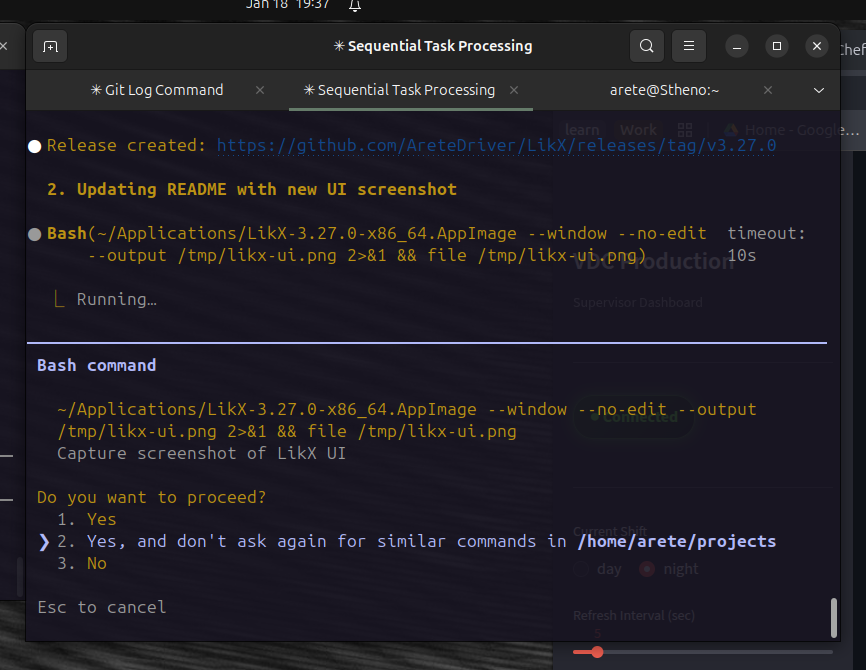

# LikX

**Screenshot capture and annotation tool for Linux**

[](https://github.com/AreteDriver/LikX/actions/workflows/ci.yml)
[](https://github.com/AreteDriver/LikX/releases/latest)
[](LICENSE)
[](https://python.org)
[](https://www.gtk.org/)

<p align="center">
  
</p>

---

## Features

### Capture
- **Multi-capture**: Fullscreen, region, window on X11 and Wayland
- **Multi-monitor**: Quick-select monitors with number keys (1-9)
- **GIF recording**: Capture animated GIFs of any screen region
- **Scrolling screenshots**: Auto-scroll and stitch long pages

### Annotation
- **Drawing tools**: Pen, highlighter, line, arrow (open/filled/double), rectangle, ellipse
- **Text tools**: Text annotations with bold/italic/fonts, callout bubbles
- **Markers**: Number markers, stamps (✓✗⚠❓), color picker
- **Selection**: Move, resize, delete with snap-to-alignment guides
- **Privacy**: Blur and pixelate tools for sensitive data
- **Crop**: Drag to crop with Shift for 1:1 aspect ratio lock

### Features
- **OCR**: Extract text from screenshots via Tesseract
- **Pin to desktop**: Keep screenshots always visible while working
- **Effects**: Shadow, border, background, rounded corners, brightness/contrast
- **Cloud upload**: Imgur, Amazon S3, Dropbox, Google Drive
- **History browser**: Visual thumbnail browser for all captures
- **Customizable hotkeys**: Configure all keyboard shortcuts
- **Multi-language**: 8 languages (English, Spanish, French, German, Portuguese, Italian, Russian, Japanese)

---

## Installation

### Snap Store (Recommended)
```bash
sudo snap install likx
```

### AppImage
Download the latest `.AppImage` from [GitHub Releases](https://github.com/AreteDriver/LikX/releases):
```bash
chmod +x LikX-*.AppImage
./LikX-*.AppImage
```

### Debian/Ubuntu (.deb)
```bash
wget https://github.com/AreteDriver/LikX/releases/latest/download/likx_amd64.deb
sudo dpkg -i likx_amd64.deb
sudo apt-get install -f  # Fix dependencies
```

### From Source
```bash
git clone https://github.com/AreteDriver/LikX.git
cd LikX/LikX
./setup.sh
python3 main.py
```

---

## Quick Start

```bash
likx                    # Launch GUI
likx --fullscreen       # Capture fullscreen
likx --region           # Capture region
likx --window           # Capture window
```

### Global Hotkeys (GNOME)
| Shortcut | Action |
|----------|--------|
| `Ctrl+Shift+F` | Fullscreen capture |
| `Ctrl+Shift+R` | Region capture |
| `Ctrl+Shift+W` | Window capture |
| `Ctrl+Alt+G` | Record GIF |
| `Ctrl+Alt+S` | Scrolling screenshot |

> Hotkeys are customizable in Settings > Hotkeys

### Editor Shortcuts
| Shortcut | Action |
|----------|--------|
| `Ctrl+Shift+P` | Command Palette |
| `Ctrl+S` | Save |
| `Ctrl+C` | Copy to clipboard |
| `Ctrl+Z` / `Ctrl+Y` | Undo / Redo |
| `Delete` / `Backspace` | Delete selected annotation |
| `V` | Select tool (move/resize) |
| `P` `H` `L` `A` | Pen, Highlighter, Line, Arrow |
| `R` `E` `T` `B` | Rectangle, Ellipse, Text, Blur |
| `X` `M` `N` `I` | Pixelate, Measure, Number, Color Picker |
| `S` `Z` `K` `C` | Stamp, Zoom, Callout, Crop |
| Right-click | Radial menu |

---

## Platform Support

| Platform | Status | Tools Required |
|----------|--------|----------------|
| **X11** | Full | xdotool |
| **Wayland (GNOME)** | Full | gnome-screenshot |
| **Wayland (KDE)** | Full | spectacle |
| **Wayland (Sway)** | Full | grim |

**Tested on:** Ubuntu 22.04/24.04, Fedora 39/40, Arch, Pop!_OS, Manjaro, Debian

---

## Comparison

| Feature | LikX | Flameshot | Ksnip | Shutter |
|---------|------|-----------|-------|---------|
| Wayland | Yes | Partial | Yes | No |
| X11 | Yes | Yes | Yes | Yes |
| GIF Recording | Yes | No | No | No |
| Scrolling Capture | Yes | No | No | Yes |
| OCR | Yes | No | Yes | No |
| Pin to Desktop | Yes | No | No | No |
| Visual Effects | Yes | No | No | Yes |
| Blur/Pixelate | Yes | Yes | Yes | Yes |
| Cloud Upload | Yes | Yes | Yes | Yes |
| Multi-language | Yes | Yes | Yes | Yes |
| Snap Store | Yes | Yes | Yes | No |
| AppImage | Yes | Yes | Yes | No |

---

## Dependencies

**Core:**
- python3 (>= 3.8)
- python3-gi, python3-gi-cairo, python3-cairo
- gir1.2-gtk-3.0, gir1.2-gdkpixbuf-2.0

**X11:** xdotool, xclip

**Wayland:** gnome-screenshot (GNOME), spectacle (KDE), grim (Sway)

**GIF Recording:** ffmpeg (X11), wf-recorder (Wayland), gifsicle (optional, for optimization)

**Scrolling Capture:** opencv-python-headless (pip), xdotool (X11), ydotool or wtype (Wayland)

**OCR:** tesseract-ocr, tesseract-ocr-eng

---

## Project Structure

```
LikX/
├── main.py                  # Entry point
├── src/
│   ├── capture.py           # X11 + Wayland capture
│   ├── editor.py            # Annotation suite
│   ├── ui.py                # Main interface
│   ├── ocr.py               # OCR extraction
│   ├── pinned.py            # Pin to desktop
│   ├── history.py           # History browser
│   ├── effects.py           # Visual effects
│   ├── hotkeys.py           # Global shortcuts
│   ├── uploader.py          # Cloud upload
│   ├── notification.py      # Desktop alerts
│   ├── i18n.py              # Internationalization
│   ├── recorder.py          # GIF recording
│   ├── recording_overlay.py # GIF recording UI
│   ├── scroll_capture.py    # Scrolling screenshots
│   └── scroll_overlay.py    # Scroll capture UI
├── locale/                  # Translation files (8 languages)
│   ├── likx.pot             # Translation template
│   ├── es/LC_MESSAGES/      # Spanish
│   ├── fr/LC_MESSAGES/      # French
│   ├── de/LC_MESSAGES/      # German
│   ├── pt/LC_MESSAGES/      # Portuguese
│   ├── it/LC_MESSAGES/      # Italian
│   ├── ru/LC_MESSAGES/      # Russian
│   └── ja/LC_MESSAGES/      # Japanese
├── snap/                    # Snap packaging
├── AppDir/                  # AppImage packaging
└── debian/                  # Debian packaging
```

---

## Contributing

1. Fork the repository
2. Create feature branch
3. Make changes
4. Run `ruff check src/ main.py && ruff format src/ main.py`
5. Submit pull request

### Adding Translations

1. Copy `locale/likx.pot` to `locale/<lang>/LC_MESSAGES/likx.po`
2. Edit the `.po` file with your translations
3. Compile: `msgfmt locale/<lang>/LC_MESSAGES/likx.po -o locale/<lang>/LC_MESSAGES/likx.mo`
4. Test: `LANG=<lang> python3 main.py`

To extract new strings after code changes:
```bash
./scripts/extract_strings.sh
```

---

## License

MIT License - Free to use, modify, and distribute.

---

## Links

- [Report Bug](https://github.com/AreteDriver/LikX/issues)
- [Request Feature](https://github.com/AreteDriver/LikX/issues)
- [GitHub Releases](https://github.com/AreteDriver/LikX/releases)
